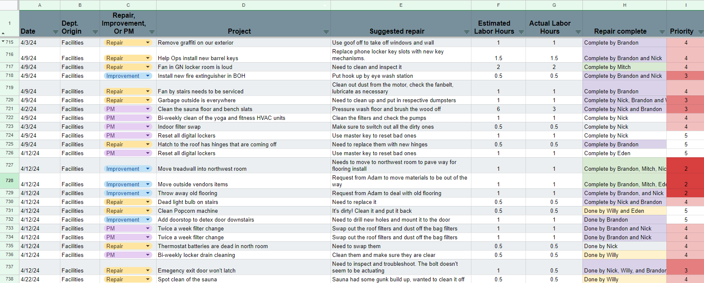
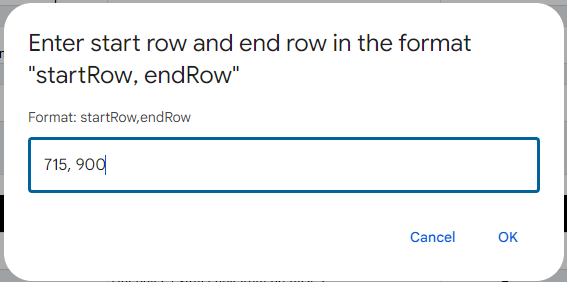
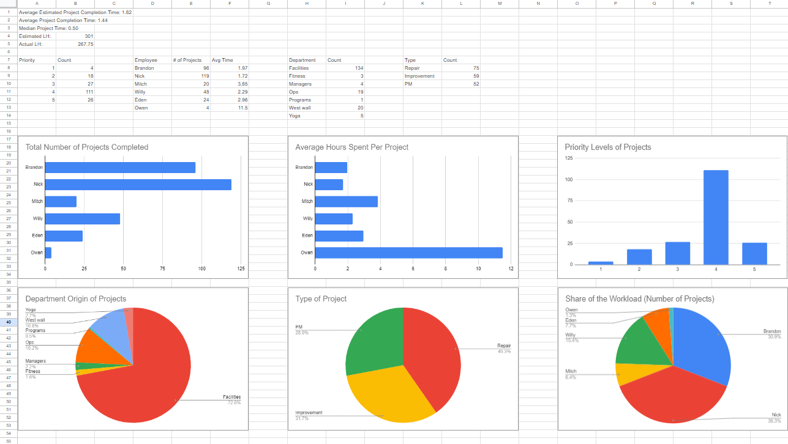

# project-data-scraper
This is a Google Script that I wrote to efficiently scrape project data of a given format and extract meaningful data. 

This script is fairly simple, and only requires that you have your Google sheet laid out in the following way:

## [Google Sheet template](https://docs.google.com/spreadsheets/d/1kNSHkTfDl5g8BcuSDXxT_PtfF8zGW7cK0eEp75btdww/edit?usp=sharing)

An important note is that regular expressions are used to separate the people who completed the project (column H; Repair Complete). The regex looks for the word "by", and then pulls the names that follow. That is, "By Mitch", "Completed haphazardly by Mitch", and "Done by Mitch and Brandon" all work just fine. It will encounter some trouble if you simply list the names without the word "by".

Once the code is pasted into a new script in the Extensions > Apps Script location, and after allowing the script to make changes to your Google Sheet, a new tab titled "Generate Project Data" should appear. Upon selecting "Run Script" in this dropdown, you will be prompted to enter a comma separated start and end row number. The script will then run on the columns in that range (inclusive).

It will crunch the numbers, generate a new tab in your Sheet, and populate it with the information. Some graphs are auto generated, but all of the sums/averages are provided for any further analysis that you may want to perform. An example of the output sheet is below (Though I did shift some graphs around to make a pretty picture).

